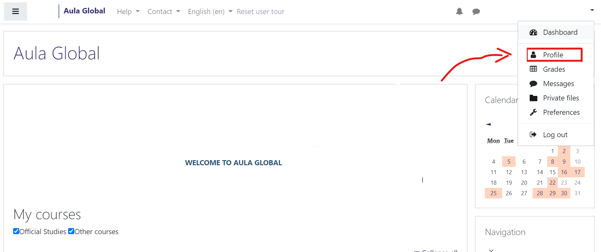
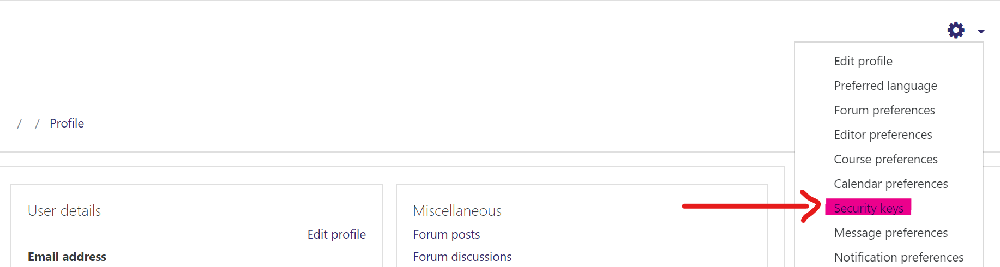

# AulaGlobal-CoursesFiles

Programa para descargar todos los archivos de tus cursos en tu página de Moodle Aula Virtual a tu maquina

Downloads all the files of all your courses of Moodle Aula Virtual into your machine.

Instrucciones en español: [aqui](%Instrucciones)

English Instructions: [aqui](%Use)

## Use Example:
```
python download_AG_courses.py -t mysecuritytoken -d C:\Users\user\Documents\mycourses
```

## Requirements / Requerimientos:

Python 3 or Python 2.7

Download Python: https://www.python.org/downloads/

Download Python 3.7: https://www.python.org/downloads/release/python-372/

Download Python 2.7: https://www.python.org/downloads/release/python-279/

##Instrucciones

Descarga el repositorio clockeando: `Clone or download > Download ZIP` y descomprimelo en tu maquina.

Corre el programa en python con `download_AG_courses.py` pasando los siguientes argumentos:

- -t : Tu token de seguridad de `aulaglobalmovil`, que es diferente a la contraseña que usas para entrar a la plataforma.
- -d : Ruta a la carpeta en la que se guardaran los archivos descargados. **Opcional**. Se guardaran en `./cursos` por defecto.

### Para conseguir el token de seguridad:

Puedes conseguir tu clave de seguridad entrando a la plataforma de Aula Virtual con tu usuario y contraseña e ir a "Perfil" (Clickea tu nombre en la esquina superior derecha para ver el menú), despues abre el menu de configuracion en la esquina superior derecha de la página y clickea en "Claves de seguridad". Copia la clave que tiene `servicio: aulaglobalmovil`.

> Si el token esta expirado solo crea uno nuevo en `Operación > Reiniciar`.

##Use
Download the repository by clicking: `Clone or download > Download ZIP` and then uncompress it.

Run the script `download_AG_courses.py` with the arguments: 

- -t Your personal `aulaglobalmovil` Security key, which is different from the password you use to log in to the platform.
- -d Machine path to directory where files will be downloaded. Defaults to `./cursos` **Optional**

### Get your token:

You can get your security key token by logging in to Aula Virtual and going to "Profile" (If you are on the main page, just click your name and then open `Profile`), then open the configuration menu on the top right corner of the page and click "Security keys". Then copy the key that has `Service: aulaglobalmovil`

> If the token is expired just click on `Operation > Reset`, It'll immediately create a new valid token.

Then copy the key that says `service: aulaglobalmovil`. You can reset this key at any time if you want.

## Example images to get security token:





